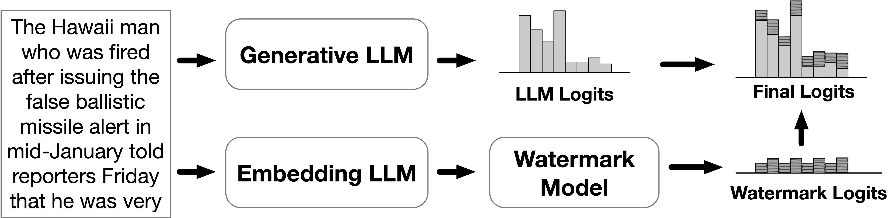

<!--  -->

# A Semantic Invariant Robust (SIR) Watermark for Large Language Models



## News

💡 **_<span style="color: #0366d6;">Our SIR watermark has been integrated into [MarkLLM](https://github.com/THU-BPM/MarkLLM), an open-source toolkit for LLM watermarking. You can now try out our watermarking method in the MarkLLM repository!</span>_**

## Conda Environment

- python 3.9
- pytorch
- `pip install -r requirements.txt`

## Step1: Generate embeddings for training watermark model

- dataset could be downloaded from: https://huggingface.co/datasets/mteb/stsbenchmark-sts/tree/main
- model could be downloaded from: https://huggingface.co/perceptiveshawty/compositional-bert-large-uncased/tree/main
- place dataset under 'data/sts/', place model anywhere you want, then change the `--model path` of the following command

```
python generate_embeddings.py --input_path data/sts/train.jsonl --output_path data/embeddings/train_embeddings.txt --model_path xxx/compositional-bert-large-uncased --size 2000
```

## Step2: Train watermark model

train the watermark model using the embeddings generated in step1

```
python train_watermark_model.py --input_path data/embeddings/train_embeddings.txt --output_model model/transform_model_cbert.pth --input_dim 1024
```

you could check the quality of the trained model by running the following command to visualize the similarity:

```
python analysis_transform_model.py  --embedding_file data/embeddings/train_embeddings.txt --input_dim 1024 --checkpoint model/transform_model_cbert.pth --figure_dir data/figures/
```

## Step3: Generate watermarked text & Detect:

- generate mapping files, set `--length` according to length of LLM tokenizer

  ```
  python generate_mappings.py --length 50257 --output_dir data/mappings/ 
  ```
- generate watermarked text & detect，set `--llm_path` and `--embedding_model` by yourself

  ```
  python watermark_and_detect.py --watermark_type context --base_model gpt2 --llm_path xxx/gpt2/ --generate_number 10 --delta 1 --chunk_size 10 --max_new_tokens 200 --data_path data/dataset/c4_train_sample.jsonl --output_path output.json --transform_model model/transform_model_cbert.pth --embedding_model xxx/compositional-bert-large-uncased  --decode_method sample
  ```

  The format of output.json is as follows:

  ```
  {
    "original_text": "xxxxx",
    "generated_text": "xxxxx",
    "z_score_origin": -0.11703870834215828,
    "z_score_generated": 0.6135051294082874
   }
  ```

  `original_text` represents a natural corpus, whereas `generated_text` contains a watermark. The z_score for both texts are calculated using the watermark detector. You have the flexibility to perform binary classification by either setting a suitable fixed z_threshold or dynamically adjusting it.

## Others

We also provide implementations of several watermark removal attacks in `attacks/`, including:

- random/context-based synonym substitution (`attacks/text_util.py`)
- paraphrasing attack using dipper (`attacks/dipper.py`) and gpt-3.5/gpt-4 (`attacks/openai_util.py`).


## Citation
If you find SIR useful or use SIR (model, code, dataset, etc.) in your research, please cite it in your publications.

```
@inproceedings{
  liu2024a,
  title={A Semantic Invariant Robust Watermark for Large Language Models},
  author={Aiwei Liu and Leyi Pan and Xuming Hu and Shiao Meng and Lijie Wen},
  booktitle={The Twelfth International Conference on Learning Representations},
  year={2024},
  url={https://openreview.net/forum?id=6p8lpe4MNf}
}
```

<div style="text-align: center;">

</div>